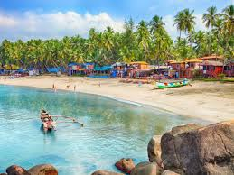
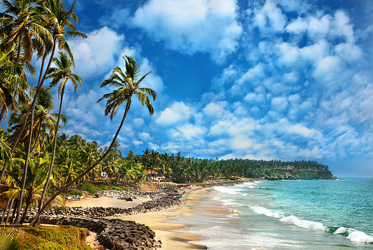
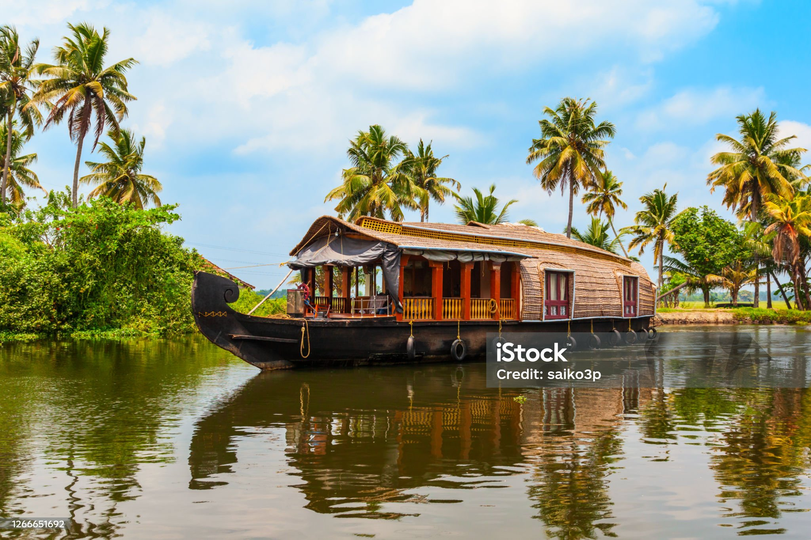
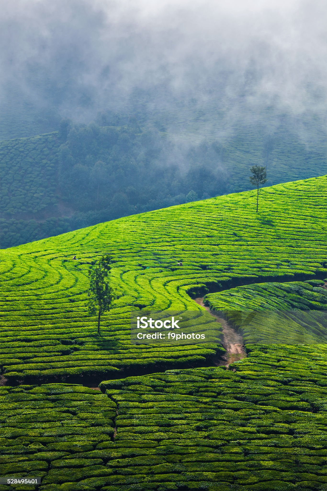

# Ex.08 Design of Interactive Image Gallery
## Date:24/12/24

## AIM:
To design a web application for an inteactive image gallery with minimum five images.

## DESIGN STEPS:

### Step 1:
Clone the github repository and create Django admin interface.

### Step 2:
Change settings.py file to allow request from all hosts.

### Step 3:
Use CSS for positioning and styling.

### Step 4:
Write JavaScript program for implementing interactivity.

### Step 5:
Validate the HTML and CSS code.

### Step 6:
Publish the website in the given URL.

## PROGRAM :
```

<!DOCTYPE html>
<html lang="en">
<head>
    <meta charset="UTF-8">
    <meta name="viewport" content="width=device-width, initial-scale=1.0">
    <title>Interactive Photo Gallery</title>
    <style>
        body {
            background-color: #222;
            font-family: 'Open Sans', sans-serif;
            margin: 0;
            padding: 0;
            display: flex;
            flex-direction: column;
            align-items: center;
            justify-content: center;
            min-height: 100vh;
        }

        .header {
            text-align: center;
            color: white;
            font-size: 24px;
            font-weight: bold;
            margin-bottom: 20px;
        }

        .gallery-container {
            display: grid;
            grid-template-columns: repeat(auto-fill, minmax(200px, 1fr));
            gap: 15px;
            padding: 20px;
            max-width: 1200px;
            width: 100%;
            animation: fadeIn 1s ease-in-out;
        }

        .gallery-item {
            position: relative;
            overflow: hidden;
            border-radius: 10px;
            box-shadow: 0 8px 16px rgba(0, 0, 0, 0.2);
        }

        .gallery-item img {
            width: 100%;
            height: auto;
            border-radius: 10px;
            transition: transform 0.3s ease, filter 0.3s ease;
        }

        .gallery-item img:hover {
            transform: scale(1.1);
            filter: brightness(0.8);
            cursor: pointer;
        }

        .caption {
            position: absolute;
            bottom: 8px;
            left: 8px;
            background-color: rgba(0, 0, 0, 0.7);
            color: white;
            padding: 4px 8px;
            border-radius: 4px;
            font-size: 12px;
            text-align: center;
            width: calc(100% - 16px);
        }

        .modal {
            display: none;
            position: fixed;
            z-index: 1;
            top: 0;
            left: 0;
            width: 100%;
            height: 100%;
            background-color: rgba(0, 0, 0, 0.8);
            align-items: center;
            justify-content: center;
        }

        .modal-content {
            margin: auto;
            display: block;
            width: 80%;
            max-width: 600px;
            border-radius: 10px;
        }

        .close {
            position: absolute;
            top: 10px;
            right: 20px;
            color: white;
            font-size: 30px;
            cursor: pointer;
        }

        .modal-description {
            color: white;
            text-align: center;
            padding: 10px;
            font-size: 16px;
        }

        @keyframes fadeIn {
            from { opacity: 0; }
            to { opacity: 1; }
        }
    </style>
</head>
<body>

    <div class="header">Kerala Gallery</div>

    <div class="gallery-container">
        <div class="gallery-item">
            
            <div class="caption">Christchurch</div>
        </div>
        <div class="gallery-item">`
            
            <div class="caption">Tasman Sea</div>
        </div>
        <div class="gallery-item">
            
            <div class="caption">Dunadin</div>
        </div>
        <div class="gallery-item">
            
            <div class="caption">Tauranga</div>
        </div>
        <div class="gallery-item">
            
            <div class="caption">Whangarei</div>
        </div>
    </div>

    <div class="modal" id="modal">
        <span class="close" id="close">&times;</span>
        
        <div class="modal-description" id="modal-description"></div>
    </div>

    <script>
        const images = document.querySelectorAll('.gallery-item img');
        const modal = document.getElementById('modal');
        const modalImg = document.getElementById('modal-img');
        const modalDescription = document.getElementById('modal-description');
        const closeBtn = document.getElementById('close');

        images.forEach((image) => {
            image.addEventListener('click', () => {
                modal.style.display = 'flex';
                modalImg.src = image.src;
                modalDescription.textContent = image.getAttribute('data-description');
            });
        });

        closeBtn.addEventListener('click', () => {
            modal.style.display = 'none';
        });
    </script>
</body>
</html>
```


## OUTPUT:


## RESULT:
The program for designing an interactive image gallery using HTML, CSS and JavaScript is executed successfully.
